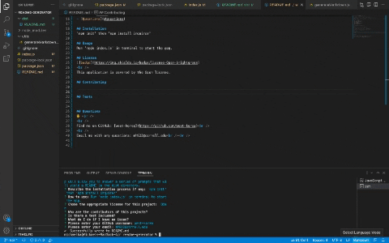

<h1 align="center">README generator </h1>
  
 

## Description
This is a node.js app for generating a README.  Running this app will allow you to answer a series of prompts that will yield a README in the dist directory.

## Table of Contents
- [Description](#description)
- [Installation](#installation)
- [Usage](#usage)
- [License](#license)
- [Contributing](#contributing)
- [Tests](#tests)
- [Questions](#questions)

## Installation
'npm init' then 'npm install inquirer'

## Usage
Run 'node index.js' in terminal to start the app.

## License

 
This application is covered by the Open license. 

## Contributing

## Tests

## Questions
✋  
 
Find me on GitHub: [west-korea](https://github.com/west-korea) 
 
Email me with any questions: mh922@cornell.edu  

## Demo

